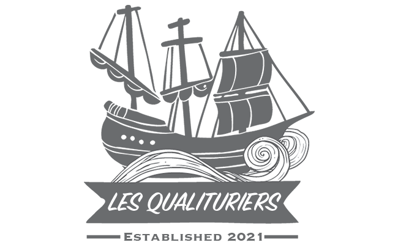

# pns-si3-qgl-2021-les_qualituriers



# Team : 
- Equipe : les qualituriers
- Bateau : la qualiravelle

# Authors : 
- Arcil Alexandre
- Bedjguelal Redouan
- Clodong Yann
- D'Andrea William

# Projet

Projet réalisé dans le cadre du cours SI3 - QGL (3ème année d'école d'ingénieur - Polytech Nice Sophia Antipolis - Filière Sciences Informatique - Qualité & Génie Logiciel).

Ce projet à pour objectif de mettre en avant les concepts de qualité abordé durant ce cours autour d'un programme ayant pour but de réaliser un bot jouant à une bataille navale amélioré, avec une gestion des déplacements des bateaux et d'évitemment d'obstacles. 

# Lancer une analyse qualité

Vous pouvez lancé ces commandes dans le fichier source du projet, il est inutile de se déplacer dans le module player. 

**Analyse Sonar :**

*Cette commande ne lance que le runner SONAR et enregistre l'analyse du code dans la BDD sonar, il est nécessaire d'avoir déjà un serveur installé sur votre machine*
```
mvn clean verify -PsonarCoverage sonar:sonar -Dsonar.login="YOUR_LOGIN" -Dsonar.password="YOUR_PASSWORD"
```

**Analyse PiTest :**
```
mvn package -Ppitest org.pitest:pitest-maven:mutationCoverage
```
Résultats disponibles dans player.target.pit-report
